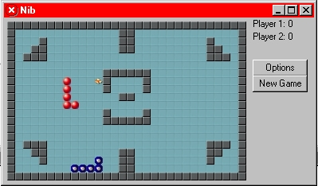

<div align="center">

## Snakes


</div>

### Description

1 or 2 Players. Eat food and dodge walls and other snakes to complete each level.
 
### More Info
 


<span>             |<span>
---                |---
**Submitted On**   |2003-12-03 14:40:40
**By**             |[Code Toad](https://github.com/Planet-Source-Code/PSCIndex/blob/master/ByAuthor/code-toad.md)
**Level**          |Advanced
**User Rating**    |5.0 (10 globes from 2 users)
**Compatibility**  |VB 6\.0
**Category**       |[Games](https://github.com/Planet-Source-Code/PSCIndex/blob/master/ByCategory/games__1-38.md)
**World**          |[Visual Basic](https://github.com/Planet-Source-Code/PSCIndex/blob/master/ByWorld/visual-basic.md)
**Archive File**   |[Snakes1679881232003\.zip](https://github.com/Planet-Source-Code/code-toad-snakes__1-50297/archive/master.zip)

### API Declarations

```
Private Declare Function StretchBlt Lib "gdi32" (ByVal hdc As Long, ByVal X As Long, ByVal Y As Long, ByVal nWidth As Long, ByVal nHeight As Long, ByVal hSrcDC As Long, ByVal xSrc As Long, ByVal ySrc As Long, ByVal nSrcWidth As Long, ByVal nSrcHeight As Long, ByVal dwRop As Long) As Long
Private Declare Function BitBlt Lib "gdi32" (ByVal hDestDC As Long, ByVal X As Long, ByVal Y As Long, ByVal nWidth As Long, ByVal nHeight As Long, ByVal hSrcDC As Long, ByVal xSrc As Long, ByVal ySrc As Long, ByVal dwRop As Long) As Long
Private Declare Function CreateCompatibleDC Lib "gdi32" (ByVal hdc As Long) As Long
Private Declare Function DeleteDC Lib "gdi32" (ByVal hdc As Long) As Long
Private Declare Function GetPixel Lib "gdi32" (ByVal hdc As Long, ByVal X As Long, ByVal Y As Long) As Long
Private Declare Function GetTickCount Lib "kernel32" () As Long
Private Declare Sub Sleep Lib "kernel32" (ByVal dwMilliseconds As Long)
```


